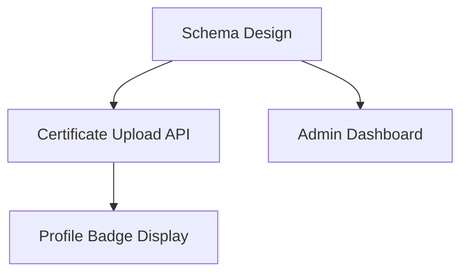

## I Hated Writing Specs

Honestly, I love writing code, but writing specs is a chore. The idea is in my head, I roughly know what needs to be built, but turning that into GitHub Issues takes forever.

- What should the issue title be?
- How do I write the Acceptance Criteria?
- Should this feature be one issue or three?
- What about priorities? Dependencies?

Every time I go through these questions, I spend the whole day organizing issues instead of actually coding.

So I built it. **A PM agent that converts a one-line requirement into GitHub Issues.**


## Demo: How It Actually Works

```bash
npx tsx src/agent.ts "Add workplace verification to user profiles" \
  --project ./primeet-app \
  --output github \
  --repo wonderx/primeet-app
```

Running this kicks off a 4-phase process.

### Phase 1: Codebase Analysis (Silently)

When you provide a `--project` path, the agent first reads the codebase. It identifies existing type definitions, service patterns, and directory structure. This happens silently without asking the user anything.

### Phase 2: Questions (Only the Essentials)

```
Q1. Who uses this feature and in what context?
Q2. What's the priority and timeline?
Q3. What's the scope and what are the edge cases?
Q4. What does success look like?
```

It compresses what would be a rambling human conversation into 4 focused questions. Based on the answers, it locks down the requirement boundaries.

### Phase 3: Issue Breakdown + Feedback

The agent drafts issues and presents them.

```
🔵 Issue #1 [P1] Workplace verification DB schema design (S)
🟡 Issue #2 [P1] Certificate upload API (M)  → depends on #1
🟢 Issue #3 [P2] Show verification badge on profile UI (M) → depends on #2
🟠 Issue #4 [P2] Admin verification approval dashboard (L) → depends on #1
```

Each issue includes **background, detailed requirements, Acceptance Criteria, implementation hints, effort estimates, and dependencies**. Implementation hints incorporate the codebase information analyzed in Phase 1.

"Does this breakdown look right? Any issues to add or remove?"

Give feedback, and it revises and shows you again. This loop repeats until you're satisfied.

### Phase 4: Execution

Once confirmed, it registers issues directly on GitHub with `gh issue create`. It even generates a Mermaid dependency diagram to visualize the relationships between issues.



## Architecture

```
[Natural Language Requirement]
       ↓
  Phase 1: Codebase Analysis (Glob, Grep, Read)
       ↓
  Phase 2: Questions (AskUserQuestion)
       ↓
  Phase 3: Issue Breakdown + Feedback Loop
       ↓
  Phase 4: Execution (terminal | markdown | github)
```

### Core Design: MCP Tool Server

I used the **MCP (Model Context Protocol) Tool Server** pattern from the Claude Agent SDK.

```typescript
// Conditional tool loading
const tools = [presentIssues, saveMarkdown];
if (config.outputMode === 'github' || config.repo) {
  tools.push(createGitHubIssue);
}
if (config.projectPath) {
  tools.push(glob, grep, read); // Codebase analysis tools
}
```

Only the necessary tools are loaded based on configuration. Skip `--project` and codebase analysis tools are excluded entirely. Use `--output terminal` and the GitHub issue creation tool is removed.

### Dynamic System Prompts

The system prompt is also built dynamically based on configuration.

```typescript
function buildSystemPrompt(config: AgentConfig): string {
  let prompt = BASE_PROMPT;
  if (config.projectPath) {
    prompt += CODEBASE_ANALYSIS_SECTION;
  }
  if (config.outputMode === 'github') {
    prompt += GITHUB_SECTION;
  }
  return prompt;
}
```

If a codebase is provided, it adds instructions to incorporate analysis results into implementation hints. In GitHub mode, it adds issue creation instructions.


## Why This Structure Is PDCA

The agent's 4-phase workflow maps directly to the **PDCA cycle**.

| Agent Phase | PDCA | What It Does |
|-------------|------|-------------|
| Phase 1: Codebase Analysis | **Plan** | Assess current state |
| Phase 2: Questions | **Plan** | Clarify requirements |
| Phase 3: Issue Breakdown | **Do** | Create execution plan |
| Phase 3: Feedback | **Check** | Verify the plan |
| Phase 4: Execution | **Act** | Execute + apply improvements |

Phase 3's **feedback loop** is particularly important. The agent asks "Does this look right?", and when the user says "Remove this one, add that one," it loops back. Check, Act, Do repeats.

### Practical Benefits of PDCA

1. **No skipping phases**: The system prompt explicitly states "Never skip a Phase." The AI doesn't rush to create issues; it always follows the sequence: understand, question, break down, execute.

2. **Scope confirmation**: Without Phase 2's questions, the AI just "figures it out" on its own. That's dangerous. Questions nail down ambiguous areas.

3. **Quality assurance**: Without Phase 3's feedback loop, the AI's issues would go straight to GitHub unchecked. One round of verification dramatically improves output quality.

4. **Traceability**: Each issue comes with priority (P0-P3), effort (S/M/L/XL), and dependencies, enabling real project management.

## Dry Run: Safety Net

Creating GitHub issues is irreversible. That's why I built the `--dry-run` flag.

```bash
npx tsx src/agent.ts "Report feature" --output github --repo wonderx/app --dry-run
```

Instead of executing `gh issue create`, it just prints the commands. Review first, execute when ready.

## Three Output Modes

| Mode | Use Case | Command |
|------|----------|---------|
| **terminal** | Quick review | `--output terminal` |
| **markdown** | Documentation | `--output markdown` |
| **github** | Direct creation | `--output github --repo owner/repo` |

Markdown mode packs everything into one file: issue summary table + Mermaid dependency graph + detailed content + gh CLI commands. Great for archiving.

## Real-World Impressions

### What Worked Well

- **Planning time was cut in half.** Throw a one-liner from your head and get 4-5 issues back.
- **Acceptance Criteria are generated automatically.** Writing these manually every time was genuinely tedious.
- **Code-based implementation hints** let the person receiving the issue start working immediately.
- **Dependency diagrams** make the work order crystal clear.

### What Could Be Better

- The AI tends to split issues too granularly. I emphasized "completable in a single PR" sized chunks, but it sometimes overdoes it.
- Codebase analysis isn't deep. It understands function signatures but not the logic.
- GitHub Issue templates vary by team, so customization is needed for broader adoption.

## Thoughts on Claude Agent SDK + MCP

What I learned using the Claude Agent SDK:

- **MCP Tool Server is the key.** The pattern of modularizing tools and loading them conditionally is clean.
- **maxTurns setting matters.** I set it generously at 80, but question, breakdown, feedback loops burn through turns fast.
- **System prompt design determines agent quality.** You have to explicitly specify phase order, issue body structure, and prohibitions in the prompt for the AI to comply.
- **Enforcing output structure with Zod schemas** makes the AI produce consistent results.

```typescript
const GitHubIssueSchema = z.object({
  title: z.string(),
  body: z.string(),
  labels: z.array(z.string()),
  effort: z.enum(['S', 'M', 'L', 'XL']),
  priority: z.enum(['P0', 'P1', 'P2', 'P3']),
  dependencies: z.array(z.number()),
});
```

## Conclusion

When someone says "add this feature," breaking that down into concrete issues is harder than it sounds. If AI can handle this process, developers can skip the planning overhead and jump straight into coding.

The key is giving AI freedom while **enforcing the process with a PDCA framework**. Understand, question, break down, verify, execute. Make sure this sequence is never skipped, and output quality jumps dramatically.


> The era of AI only writing code is over. Now it handles planning too. But humans still need to structure the process with PDCA.
