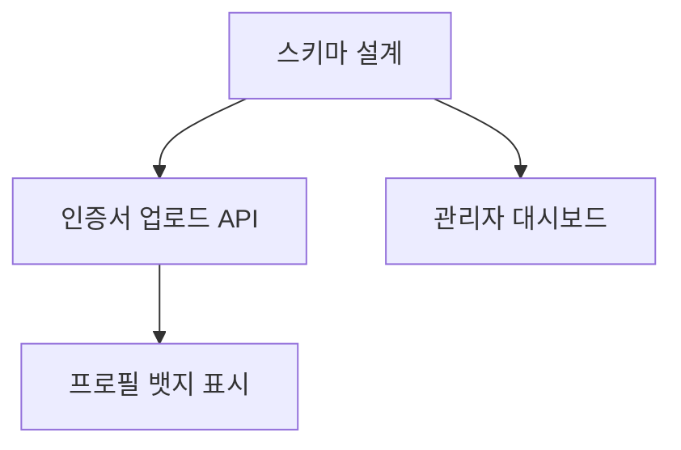

## 기획서 쓰기가 싫었다

솔직히 말하면, 코드를 짜는 건 좋은데 기획서를 쓰는 게 귀찮았다. 아이디어는 머릿속에 있고, 대충 뭘 만들어야 하는지도 아는데, 이걸 GitHub Issue로 정리하려면 한참이다.

- 이슈 제목은 뭘로 하지?
- Acceptance Criteria는 어떻게 쓰지?
- 이 기능을 이슈 하나로 할까, 세 개로 쪼갤까?
- 우선순위는? 의존성은?

매번 이런 고민을 하다 보면 정작 코딩은 안 하고 이슈 정리만 하다 하루가 간다.

그래서 만들었다. **한 줄 요구사항을 던지면 GitHub Issue로 변환해주는 PM 에이전트.**


## 데모: 실제 동작

```bash
npx tsx src/agent.ts "사용자 프로필에 직장 인증 기능 추가" \
  --project ./primeet-app \
  --output github \
  --repo wonderx/primeet-app
```

이렇게 실행하면 에이전트가 4단계를 거친다.

### Phase 1: 코드 분석 (조용히)

`--project` 경로를 주면, 에이전트가 먼저 코드베이스를 읽는다. 기존 타입 정의, 서비스 패턴, 디렉토리 구조를 파악한다. 이 과정은 사용자에게 아무것도 묻지 않고 조용히 진행된다.

### Phase 2: 질문 (핵심만)

```
Q1. 누가, 어떤 상황에서 이 기능을 사용하나요?
Q2. 우선순위와 타임라인은?
Q3. 범위와 예외 케이스는?
Q4. 성공 기준은 무엇인가요?
```

사람이 하면 장황해질 질문을 4개로 압축한다. 답변을 기반으로 요구사항의 경계를 확정짓는다.

### Phase 3: 이슈 분해 → 피드백

에이전트가 이슈 초안을 만들어서 보여준다.

```
🔵 Issue #1 [P1] 직장 인증 DB 스키마 설계 (S)
🟡 Issue #2 [P1] 인증서 업로드 API (M)  → depends on #1
🟢 Issue #3 [P2] 프로필 UI에 인증 뱃지 표시 (M) → depends on #2
🟠 Issue #4 [P2] 관리자 인증 승인 대시보드 (L) → depends on #1
```

각 이슈에는 **배경, 상세 요구사항, Acceptance Criteria, 구현 힌트, 예상 공수, 의존성**이 포함된다. 구현 힌트에는 Phase 1에서 분석한 코드베이스 정보가 반영된다.

"이 분해가 적절한가요? 추가하거나 삭제할 이슈가 있나요?"

피드백을 주면 반영해서 다시 보여준다. 이 루프를 만족할 때까지 반복한다.

### Phase 4: 실행

확인이 끝나면 `gh issue create`로 GitHub에 바로 등록한다. Mermaid 의존성 다이어그램까지 생성해서 이슈 간의 관계를 시각화한다.



## 아키텍처

```
[자연어 요구사항]
       ↓
  Phase 1: 코드 분석 (Glob, Grep, Read)
       ↓
  Phase 2: 질문 (AskUserQuestion)
       ↓
  Phase 3: 이슈 분해 + 피드백 루프
       ↓
  Phase 4: 실행 (terminal | markdown | github)
```

### 핵심 설계: MCP Tool Server

Claude Agent SDK의 **MCP(Model Context Protocol) Tool Server** 패턴을 사용했다.

```typescript
// 조건부 도구 로딩
const tools = [presentIssues, saveMarkdown];
if (config.outputMode === 'github' || config.repo) {
  tools.push(createGitHubIssue);
}
if (config.projectPath) {
  tools.push(glob, grep, read); // 코드 분석 도구
}
```

설정에 따라 필요한 도구만 로딩한다. `--project`를 안 주면 코드 분석 도구가 아예 빠지고, `--output terminal`이면 GitHub 이슈 생성 도구가 빠진다.

### 동적 시스템 프롬프트

시스템 프롬프트도 설정에 따라 동적으로 빌드된다.

```typescript
function buildSystemPrompt(config: AgentConfig): string {
  let prompt = BASE_PROMPT;
  if (config.projectPath) {
    prompt += CODEBASE_ANALYSIS_SECTION;
  }
  if (config.outputMode === 'github') {
    prompt += GITHUB_SECTION;
  }
  return prompt;
}
```

코드베이스가 있으면 "코드 분석 결과를 구현 힌트에 반영하라"는 지시가 추가되고, GitHub 모드면 이슈 생성 관련 지시가 추가된다.


## 이 구조가 PDCA인 이유

이 에이전트의 4단계 워크플로우는 사실 **PDCA 사이클**과 정확히 대응한다.

| 에이전트 Phase | PDCA | 하는 일 |
|---------------|------|---------|
| Phase 1: 코드 분석 | **Plan** | 현재 상태 파악 |
| Phase 2: 질문 | **Plan** | 요구사항 구체화 |
| Phase 3: 이슈 분해 | **Do** | 실행 계획 수립 |
| Phase 3: 피드백 | **Check** | 계획 검증 |
| Phase 4: 실행 | **Act** | 실행 + 개선 반영 |

특히 Phase 3의 **피드백 루프**가 중요하다. 에이전트가 "이대로 괜찮나?"를 물어보고, 사용자가 "이건 빼고, 이건 추가해"라고 하면 다시 돌아간다. Check → Act → Do가 반복된다.

### PDCA의 실질적 이점

1. **건너뛰기 방지**: 시스템 프롬프트에 "절대 Phase를 건너뛰지 마세요"를 명시했다. AI가 성급하게 이슈를 만들지 않고, 반드시 이해 → 질문 → 분해 → 실행 순서를 따른다.

2. **범위 확정**: Phase 2의 질문이 없으면 AI가 "알아서" 해석한다. 이게 위험하다. 질문을 통해 모호한 부분을 확정 짓는다.

3. **품질 보증**: Phase 3의 피드백 루프가 없으면 AI가 만든 이슈를 그대로 GitHub에 올리게 된다. 한 번의 검증이 결과물의 품질을 크게 올린다.

4. **추적 가능성**: 각 이슈에 우선순위(P0-P3), 공수(S/M/L/XL), 의존성이 붙어 있어서 프로젝트 관리가 된다.

## Dry Run: 안전장치

GitHub에 이슈를 직접 생성하는 건 돌이킬 수 없다. 그래서 `--dry-run` 플래그를 만들었다.

```bash
npx tsx src/agent.ts "신고 기능" --output github --repo wonderx/app --dry-run
```

실제 `gh issue create`를 실행하지 않고, 명령어만 출력한다. 확인 후 실행하면 된다.

## 출력 모드 3종

| 모드 | 용도 | 명령어 |
|------|------|--------|
| **terminal** | 빠른 확인 | `--output terminal` |
| **markdown** | 문서 보관 | `--output markdown` |
| **github** | 바로 등록 | `--output github --repo owner/repo` |

마크다운 모드는 이슈 요약 테이블 + Mermaid 의존성 그래프 + 상세 내용 + gh CLI 명령어까지 한 파일에 담긴다. 나중에 참고용으로 아카이빙하기 좋다.

## 실전에서 느낀 점

### 좋았던 것

- **기획 시간이 반으로 줄었다.** 머릿속 아이디어를 한 줄로 던지면 이슈 4-5개가 나온다.
- **Acceptance Criteria가 자동으로 붙는다.** 이걸 매번 수동으로 쓰는 건 정말 귀찮은 일이었다.
- **코드 기반 구현 힌트**가 나와서, 이슈를 받는 쪽에서 바로 작업에 들어갈 수 있다.
- **의존성 다이어그램**이 작업 순서를 명확하게 해준다.

### 아쉬운 것

- AI가 이슈를 너무 잘게 쪼개는 경향이 있다. "하나의 PR로 완결 가능한" 크기를 강조했지만, 가끔 오버한다.
- 코드 분석이 깊지는 않다. 함수 시그니처 수준이지 로직까지 이해하진 못한다.
- GitHub Issue 템플릿이 팀마다 다르기 때문에, 범용적으로 쓰려면 커스터마이징이 필요하다.

## Claude Agent SDK + MCP 소감

이번에 Claude Agent SDK를 써보면서 느낀 점:

- **MCP Tool Server가 핵심이다.** 도구를 모듈로 분리하고 조건부로 로딩하는 패턴이 깔끔하다.
- **maxTurns 설정이 중요하다.** 80으로 넉넉하게 잡았는데, 질문 → 분해 → 피드백 루프를 돌리면 금방 쓴다.
- **시스템 프롬프트 설계가 에이전트의 품질을 결정한다.** 프롬프트에 Phase 순서, 이슈 본문 구조, 금지 사항을 명시적으로 적어야 AI가 따른다.
- **Zod 스키마로 출력 구조를 강제**하면 AI가 일관된 포맷으로 결과를 낸다.

```typescript
const GitHubIssueSchema = z.object({
  title: z.string(),
  body: z.string(),
  labels: z.array(z.string()),
  effort: z.enum(['S', 'M', 'L', 'XL']),
  priority: z.enum(['P0', 'P1', 'P2', 'P3']),
  dependencies: z.array(z.number()),
});
```

## 결론

"기능 하나 추가해줘"라는 말이 나올 때, 그걸 구체적인 이슈로 분해하는 건 생각보다 어렵다. AI가 이 과정을 대신해줄 수 있다면, 개발자는 기획 오버헤드 없이 바로 코딩에 들어갈 수 있다.

핵심은 AI에게 자유를 주되, **PDCA 프레임워크로 프로세스를 강제**하는 것이다. 이해 → 질문 → 분해 → 검증 → 실행. 이 순서를 건너뛰지 않게 만들면, 결과물의 품질이 확 올라간다.


> AI가 코드만 짜주는 시대는 지났다. 이제는 기획까지 한다. 단, 사람이 PDCA로 프로세스를 잡아줘야 한다.
